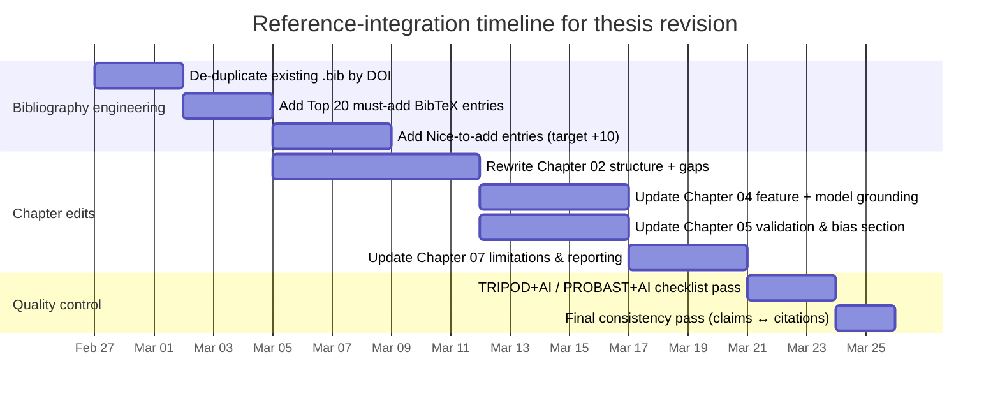

# Thesis literature-review and bibliography reinforcement for Parkinson’s voice classification

## Executive summary

Enabled connectors used: **github** (restricted to `christos97/parkinsons-voice-classification`). fileciteturn31file1

Your thesis is already aligned with several “good practice” pillars for biomedical ML: classical models, explicit mean ± std reporting, and (crucially) **subject-level grouped cross-validation** for the raw-audio dataset. fileciteturn35file0turn31file0 The fastest way to strengthen the scientific grounding is to (i) upgrade Chapter 2 from a “survey of PD/voice/ML” into a **structured evidence narrative** tied directly to your datasets, features, and evaluation choices, and (ii) explicitly anchor Chapter 4–7 decisions to **evaluation-bias** and **reporting** standards that are now widely expected (e.g., TRIPOD+AI, PROBAST+AI). citeturn1search4turn1search1turn8search0turn2search18

Things I had to learn from your repo (to make the citation plan thesis-specific):

- Which datasets you actually use (raw smartphone calls vs pre-extracted feature table), and their limitations. fileciteturn31file0turn33file0turn31file1  
- Exact feature families you extract (prosodic + spectral; MFCC/delta; jitter/shimmer/HNR; formants; etc.) and the extraction assumptions. fileciteturn39file3turn40file2turn31file4  
- Your CV strategy and why it differs across datasets (grouped vs not grouped). fileciteturn35file0turn33file0  
- The classical ML models you benchmark and how pipelines are built. fileciteturn36file0turn35file0  
- What you report as primary metrics and how results are summarized. fileciteturn35file0turn40file1  

## Context extracted from the GitHub repository

Your project uses **two datasets with intentionally different evidence strength**:

- A raw-audio smartphone dataset (MDVR-KCL, phone-call style recordings) where you use **grouped (subject-level) stratified CV** to prevent subject leakage across folds. fileciteturn31file0turn35file0turn31file1  
- A **pre-extracted-feature dataset** (the UCI Parkinson’s Disease Classification dataset family, commonly known as “pd_speech_features”) where the repo explicitly notes caveats (e.g., identity/grouping constraints and leakage risks) and you therefore treat findings more cautiously. fileciteturn33file0turn31file1  

Your ML stack is classical and appropriate for an MSc thesis:

- Models include **Logistic Regression**, **SVM-RBF**, **Random Forest**, **Gradient Boosting**, and **XGBoost**, with standardized preprocessing in pipelines. fileciteturn36file0turn35file0  
- Evaluation uses repeated fold reporting (mean ± std) across common classification metrics (accuracy, precision, recall, F1, ROC-AUC). fileciteturn35file0turn40file1  

Your feature pipeline—crucial to Chapter 2/4 quality—covers core clinically-motivated voice measures:

- Prosodic/phonatory features: F0 statistics, intensity, jitter, shimmer, harmonicity/HNR, formant-related measures (with explicit voiced-frame handling noted in code). fileciteturn39file3turn31file4  
- Spectral features: MFCCs and deltas (baseline vs extended sets) plus spectral shape statistics. fileciteturn40file2turn31file4  

These implementation facts are **not** literature—so they should be referenced in the thesis as *your pipeline description*, while the *scientific justification* for each choice should be supported by external sources (below).

## Merged plan to strengthen Chapters 2, 4, 5, and 7

### Objectives for the revision

The revised thesis should make four claims robustly defensible (and explicitly scoped):

- **Clinical plausibility:** PD affects phonation/prosody/articulation; voice and speech changes can be early indicators, but heterogeneity is large. citeturn2search8turn2search3turn18search0turn18search3  
- **Feature validity:** the specific acoustic features you use (MFCCs, pitch, jitter/shimmer, HNR, formants/prosody) have established signal-processing and/or clinical voice-analysis foundations. citeturn11search9turn12search10turn12search0turn12search3  
- **Evaluation credibility:** grouped CV is required when multiple samples per subject exist; model-selection via CV can inflate results if not nested and leakage-safe. citeturn8search0turn2search18  
- **Reporting credibility:** you follow (and discuss) contemporary clinical-ML reporting and risk-of-bias expectations rather than only listing accuracy. citeturn1search4turn1search1turn17search6turn17search1  

### Literature gaps to explicitly address in Chapter 2

Your current setup (two datasets, one stronger than the other) maps to widely documented pitfalls:

- Many PD-voice ML papers report strong metrics but rely on **weak validation** (non-independent evaluation, subject leakage, optimistic tuning). citeturn2search18turn8search0  
- Dataset heterogeneity makes across-paper comparisons unreliable without harmonized protocols; this is emphasized in systematic reviews. citeturn14search9turn18search3  
- “Speech/voice biomarkers” are promising, but translation requires careful claims, external validation, and transparent reporting. citeturn18search0turn1search4turn1search1  

### Prioritized citation buckets and how many to add

To reach ~50 total citations (including yours), the most realistic plan is to add **~25–30 new external references**, distributed as:

- **Bucket A (PD voice biomarkers + clinical grounding):** ~8–10 additions (include 2–3 recent systematic/narrative reviews + 2–3 foundational PD clinical sources + 2–3 representative voice-ML studies tied to your datasets). citeturn18search0turn18search3turn2search8turn2search1turn9search0turn18search4  
- **Bucket B (ML methodology quality):** ~5–6 additions (evaluation inflation, CV bias, leakage framing, metrics interpretation). citeturn2search18turn8search0turn9search5turn13search8  
- **Bucket C (classical ML foundations):** ~6–7 additions (LR, SVM, RF, GBM, XGBoost; optionally add one RF interpretability/variable-importance guidance paper). citeturn3search0turn7search0turn4search0turn4search9turn3search0turn9search0  
- **Bucket D (speech signal processing foundations):** ~5–6 additions (MFCC, pitch extraction, prosody, jitter/shimmer, HNR, TQWT). citeturn11search9turn12search10turn11search2turn12search3turn11search4  
- **Bucket E (reporting & reproducibility guidance + dataset citations):** ~5 additions (TRIPOD+AI, PROBAST+AI, STARD 2015, CONSORT-AI/DECIDE-AI where appropriate; plus dataset landing pages for Zenodo/UCI and WHO for burden context). citeturn1search4turn1search1turn17search6turn17search0turn15search1turn15search5turn16search1  

### Chapter mapping rules

Use these rules so the thesis reads like an integrated scientific argument rather than disconnected citations:

- **Chapter 2 (Literature review):** cite (i) clinical PD background, (ii) what speech subsystems are affected, (iii) what feature families capture those subsystems, (iv) what evaluation failures exist in the literature, and (v) what systematic reviews conclude about comparability and bias. citeturn2search8turn18search0turn14search9turn2search18  
- **Chapter 4 (Methodology):** cite model foundations (LR/SVM/RF/GBM/XGB) and feature extraction foundations (MFCC/pitch/jitter/shimmer/HNR). citeturn3search0turn7search0turn11search9turn12search3  
- **Chapter 5 (Experimental design):** cite CV-bias and evaluation-design sources; justify grouped CV and cautious dataset B interpretation with methodology papers. citeturn8search0turn2search18  
- **Chapter 7 (Discussion):** cite reporting standards (TRIPOD+AI/PROBAST+AI) and position your results as “internal validation” unless external validation exists; explicitly discuss risk-of-bias items. citeturn1search4turn1search1turn17search1  

### Concrete insert-ready text snippets with citations

Below are compact snippets designed to paste into your LaTeX (use your BibTeX keys).

**Chapter 02 (Literature Review) – clinical + speech rationale**  
Parkinson’s disease (PD) is a progressive neurodegenerative disorder with both motor and non-motor symptoms; speech and voice impairments are prevalent and may appear early, motivating interest in speech-derived digital biomarkers. \cite{kalia2015parkinsons, jankovic2008pdfeatures, cao2025speechlanguagebiomarkers} citeturn2search8turn2search3turn18search0  
Systematic reviews emphasize that while many studies report high classification performance, dataset heterogeneity and inconsistent validation designs hinder reliable comparison and clinical translation. \cite{ngo2022systematicreview} citeturn14search9turn18search3  

**Chapter 04 (Methodology) – feature foundations**  
Mel-frequency cepstral coefficients (MFCCs) are a widely used spectral representation for speech and remain a standard baseline in biomedical speech classification. \cite{davis1980mfcc} citeturn11search9  
Perturbation measures (jitter/shimmer) and harmonics-to-noise ratio (HNR) are established acoustic correlates of phonatory stability and voice quality; their estimation depends on signal quality and methodological choices. \cite{gelfer1995jittershimmer, awan1994hnr} citeturn12search0turn12search3  

**Chapter 05 (Experimental Design) – bias control & grouped CV**  
When model selection/tuning is performed using cross-validation, naïvely reporting the minimum CV error can yield optimistically biased estimates; nested CV and leakage-safe design reduce inflation. \cite{varma2006nestedcv} citeturn8search0  
Recent critiques of ML in healthcare highlight that evaluation “inflationary effects” can materially exaggerate performance without real gains in model skill, reinforcing the need for cautious claims and robust validation. \cite{ge2023inflation} citeturn2search18  

**Chapter 07 (Discussion) – reporting and risk-of-bias framing**  
To support transparent interpretation and reduce overclaiming, results should be contextualized using modern reporting and appraisal frameworks for clinical prediction models (TRIPOD+AI) and structured risk-of-bias assessment (PROBAST+AI). \cite{tripod_ai_2024, probast_ai_2025} citeturn1search4turn1search1  
Accordingly, the present work should be interpreted as internal validation within the studied datasets; future work should prioritize external validation across sites/devices and prospective evaluation to support clinical generalizability. \cite{decideai2022} citeturn17search1  

### Figures you may cite safely (do not embed random web images)

If you want figures from the literature, cite these explicitly:

- Evaluation inflation and methodological critique framing: see discussion structure and evaluation critique in Ge et al. (no single “must use” figure, but it supports the evaluation narrative). citeturn2search18  
- Reporting-guidelines roadmap for clinical AI evaluation: **DECIDE-AI Fig. 1** contrasts evaluation pathways and places multiple reporting guidelines on a development timeline. citeturn17search1  
- Cross-validation bias demonstration: Varma & Simon include figures showing the distributional gap between naïve CV and true error under tuning (e.g., their bias distributions). citeturn8search0  
- Speech-marker integration schematic: Cao et al. (npj Parkinson’s Disease 2025) includes a schematic on integrating speech/language markers across the PD continuum (**their Fig. 1**). citeturn18search0  

### Mermaid integration timeline for producing the revised thesis



## Candidate reference table with chapter placement guidance

Notes:
- “Priority = High” means it should be considered for the **Top 20** or immediate add.  
- Official links are provided as DOI or publisher landing pages in `code` format.

| Priority | Bucket | Full Title | Authors | Year | Venue | DOI | Official URL | Why relevant | Suggested chapter placement |
|---|---|---|---|---:|---|---|---|---|---|
| High | A | Parkinson’s disease | WHO | 2023 | WHO Fact Sheet | — | `https://www.who.int/en/news-room/fact-sheets/detail/parkinson-disease` citeturn15search5 | Authoritative epidemiology, symptoms, treatment gaps (use for background, not ML claims). citeturn15search5 | 02_literature_review, 07_discussion |
| High | A | Parkinson’s disease | Kalia & Lang | 2015 | The Lancet | 10.1016/S0140-6736(14)61393-3 | `https://doi.org/10.1016/S0140-6736(14)61393-3` citeturn2search8 | High-impact clinical overview; anchors disease context and symptom scope. citeturn2search8 | 02_literature_review |
| High | A | Parkinson’s disease: clinical features and diagnosis | Jankovic | 2008 | JNNP | 10.1136/jnnp.2007.131045 | `https://doi.org/10.1136/jnnp.2007.131045` citeturn2search3 | Clinical diagnostic framing; helps keep ML claims clinically realistic. citeturn2search3 | 02_literature_review |
| High | A | Suitability of dysphonia measurements for telemonitoring of Parkinson’s disease | Little et al. | 2009 | IEEE TBME | 10.1109/TBME.2008.2005954 | `https://doi.org/10.1109/TBME.2008.2005954` citeturn2search1 | Canonical PD voice-telemonitoring study; links dysphonia features and PD. citeturn2search1 | 02_literature_review, 07_discussion |
| High | A | Computerized analysis of speech and voice for Parkinson’s disease: A systematic review | Ngo et al. | 2022 | CMPB | 10.1016/j.cmpb.2022.107133 | `https://www.sciencedirect.com/science/article/pii/S0169260722005144` citeturn14search9turn18search3 | Synthesizes 2010–2021 literature; explicitly highlights heterogeneity/comparability issues. citeturn14search9turn18search3 | 02_literature_review |
| High | A | Speech and language biomarkers for Parkinson’s disease prediction, early diagnosis and progression | Cao et al. | 2025 | npj Parkinson’s Disease | 10.1038/s41531-025-00913-4 | `https://www.nature.com/articles/s41531-025-00913-4` citeturn18search0 | Narrative review; useful for “early marker” framing + includes an integration schematic (Fig. 1). citeturn18search0 | 02_literature_review, 07_discussion |
| Medium | A | Speech acoustic indices for differential diagnosis between PD, MSA and PSP | Rusz et al. | 2022 | npj Parkinson’s Disease | 10.1038/s41531-022-00389-6 | `https://www.nature.com/articles/s41531-022-00389-6` citeturn14search16 | Demonstrates clinical nuance: speech features can discriminate related disorders, not just PD vs HC. citeturn14search16 | 02_literature_review |
| Medium | A | A comparative analysis of speech signal processing algorithms for PD classification and the use of TQWT | Sakar et al. | 2019 | Applied Soft Computing | 10.1016/j.asoc.2018.10.022 | `https://www.sciencedirect.com/science/article/pii/S1568494618305799` citeturn9search0 | Connects directly to the UCI “pd_speech_features” context (TQWT, MFCC, feature families). citeturn9search0 | 02_literature_review, 07_discussion |
| Medium | A | Detection of PD based on voice patterns ranking and optimized SVM | Lahmiri | 2019 | Biomed. Signal Proc. & Control | 10.1016/j.bspc.2018.08.029 | `https://www.sciencedirect.com/science/article/pii/S1746809418302271` citeturn18search4 | Representative classical-ML voice PD paper; also motivates careful tuning + reporting. citeturn18search4 | 02_literature_review |
| Medium | A | Comparison of acoustic voice features derived from mobile devices and studio microphones | Fahed et al. | 2025 | Journal of Voice | 10.1016/j.jvoice.2022.10.006 | `https://doi.org/10.1016/j.jvoice.2022.10.006` citeturn16search6turn18search2 | Directly motivates device/channel caution (HNR/shimmer sensitivity) in smartphone-recorded pipelines. citeturn16search6turn18search2 | 02_literature_review, 07_discussion |
| Medium | A | The Parkinson Progression Marker Initiative (PPMI) | Marek et al. | 2011 | Prog. Neurobiology | 10.1016/j.pneurobio.2011.09.005 | `https://doi.org/10.1016/j.pneurobio.2011.09.005` citeturn16search7 | Anchors “biomarker” concept and progression framing (even if not voice-specific). citeturn16search7 | 02_literature_review |
| Medium | A | Voice-Based Detection of PD Using ML and DL: A systematic review | Malekroodi et al. | 2025 | MDPI Bioengineering | 10.3390/bioengineering12111279 | `https://www.mdpi.com/2306-5354/12/11/1279` citeturn14search6 | Broad sweep including classical ML; helps position your work relative to trends but keep scope classical. citeturn14search6 | 02_literature_review |
| Medium | A | Computerized analysis…: dataset heterogeneity warning | (Use with Ngo review) | 2022 | CMPB | 10.1016/j.cmpb.2022.107133 | `https://doi.org/10.1016/j.cmpb.2022.107133` citeturn18search3 | Use once to justify why you compare within-dataset and avoid across-paper leaderboard claims. citeturn18search3 | 07_discussion |
| Medium | B | Has ML over-promised in healthcare? Critical analysis with evidence from PD | Ge et al. | 2023 | Artif. Intell. in Medicine | 10.1016/j.artmed.2023.102524 | `https://www.sciencedirect.com/science/article/pii/S0933365723000386` citeturn2search18 | Very on-topic critique: explains how evaluation can inflate PD-ML results without real skill gain. citeturn2search18 | 05_experimental_design, 07_discussion |
| High | B | Bias in error estimation when using CV for model selection | Varma & Simon | 2006 | BMC Bioinformatics | 10.1186/1471-2105-7-91 | `https://link.springer.com/article/10.1186/1471-2105-7-91` citeturn8search0 | Canonical warning; supports nested CV rationale and cautious interpretation of tuned models. citeturn8search0 | 05_experimental_design |
| Medium | B | The relationship between Precision-Recall and ROC curves | Davis & Goadrich | 2006 | ICML (ACM) | 10.1145/1143844.1143874 | `https://dl.acm.org/doi/10.1145/1143844.1143874` citeturn9search17 | Justifies ROC-AUC vs PR-AUC choice when class imbalance matters; clarifies interpolation pitfalls. citeturn9search17 | 04_methodology, 05_experimental_design |
| Medium | B | A systematic analysis of performance measures for classification tasks | Sokolova & Lapalme | 2009 | Info. Processing & Management | 10.1016/j.ipm.2009.03.002 | `https://www.sciencedirect.com/science/article/pii/S0306457309000259` citeturn13search8 | Strong reference for metric selection/interpretation beyond accuracy. citeturn13search8 | 04_methodology |
| Medium | B | The use of the area under the ROC curve in ML eval | Bradley | 1997 | Pattern Recognition | 10.1016/S0031-3203(96)00142-2 | `https://www.sciencedirect.com/science/article/abs/pii/S0031320396001422` citeturn13search0 | Supports ROC-AUC as threshold-independent metric; classic discussion of properties. citeturn13search0 | 04_methodology |
| High | B | An introduction to ROC analysis | Fawcett | 2006 | Pattern Recognition Letters | 10.1016/j.patrec.2005.10.010 | `https://www.sciencedirect.com/science/article/pii/S016786550500303X` citeturn9search5 | Widely cited ROC primer; helps explain curves and common misuse. citeturn9search5 | 04_methodology |
| Medium | B | Comparing correlated ROC curves: a nonparametric approach | DeLong et al. | 1988 | Biometrics | 10.2307/2531595 | `https://doi.org/10.2307/2531595` citeturn10search1 | If you add statistical comparison of AUCs, this is the classic method. citeturn10search1 | 05_experimental_design |
| High | C | Generalized Linear Models | Nelder & Wedderburn | 1972 | JRSS A (OUP) | 10.2307/2344614 | `https://academic.oup.com/jrsssa/article/135/3/370/7110572` citeturn13search4 | Foundational grounding for logistic regression family and inference view. citeturn13search4 | 04_methodology |
| High | C | Applied Logistic Regression (3rd ed.) | Hosmer et al. | 2013 | Wiley (book) | 10.1002/9781118548387 | `https://dev.store.wiley.com/en-us/Applied%2BLogistic%2BRegression%2C%2B3rd%2BEdition-p-9781118548387` citeturn13search14 | Canonical applied LR reference (health-science framing, model assessment). citeturn13search14 | 04_methodology |
| High | C | Support-vector networks | Cortes & Vapnik | 1995 | Machine Learning (Springer) | 10.1007/BF00994018 | `https://link.springer.com/article/10.1007/BF00994018` citeturn3search0 | Canonical SVM theory and kernels; supports SVM-RBF baseline justification. citeturn3search0 | 04_methodology |
| High | C | Random Forests | Breiman | 2001 | Machine Learning (Springer) | 10.1023/A:1010933404324 | `https://doi.org/10.1023/A:1010933404324` citeturn7search0 | Original RF paper; supports tree ensemble baseline and variable-importance discussion. citeturn7search0 | 04_methodology |
| Medium | C | Overview of RF methodology and guidance | Boulesteix et al. | 2012 | WIREs Data Mining & KD | 10.1002/widm.1072 | `https://doi.org/10.1002/widm.1072` citeturn4search9 | Practical RF guidance (incl. importance, pitfalls) in computational biology contexts. citeturn4search9 | 04_methodology, 07_discussion |
| Medium | C | Conditional variable importance for RFs | Strobl et al. | 2008 | BMC Bioinformatics | 10.1186/1471-2105-9-307 | `https://link.springer.com/article/10.1186/1471-2105-9-307` citeturn4search10 | Supports a nuanced feature-importance discussion (correlated predictors). citeturn4search10 | 07_discussion |
| High | C | Greedy function approximation: A gradient boosting machine | Friedman | 2001 | Annals of Statistics | 10.1214/aos/1013203451 | `https://doi.org/10.1214/aos/1013203451` citeturn4search7 | Canonical GBM foundation; aligns with your GradientBoosting baselines. citeturn4search7 | 04_methodology |
| High | C | XGBoost: A Scalable Tree Boosting System | Chen & Guestrin | 2016 | KDD (ACM) | 10.1145/2939672.2939785 | `https://dl.acm.org/doi/10.1145/2939672.2939785` citeturn7search8 | Core citation for XGBoost; required if you report XGB results. citeturn7search8 | 04_methodology |
| High | D | Comparison of parametric representations… (MFCC classic) | Davis & Mermelstein | 1980 | IEEE TASSP | 10.1109/TASSP.1980.1163420 | `https://ieeexplore.ieee.org/document/1163420` citeturn11search9 | Canonical MFCC reference (ties directly to your spectral features). citeturn11search9 | 04_methodology |
| Medium | D | On the use of autocorrelation analysis for pitch detection | Rabiner | 1977 | IEEE TASSP | 10.1109/TASSP.1977.1162905 | `https://ieeexplore.ieee.org/document/1162905` citeturn12search10 | Pitch extraction foundation; supports F0-related feature rationale. citeturn12search10 | 04_methodology |
| Medium | D | On the use of autocorrelation for pitch extraction… (SIFT) | Moulines & Charpentier | 1984 | Speech Communication | 10.1016/0167-6393(84)90026-8 | `https://www.sciencedirect.com/science/article/abs/pii/0167639384900268` citeturn11search1 | Pitch/voicing estimation considerations; useful for methodological credibility. citeturn11search1 | 04_methodology |
| Medium | D | Extraction and representation of prosodic features… | Mary & Yegnanarayana | 2008 | Speech Communication | 10.1016/j.specom.2008.04.010 | `https://www.sciencedirect.com/science/article/pii/S0167639308000587` citeturn11search2 | Prosody feature foundation (F0, duration, energy contours). citeturn11search2 | 04_methodology |
| High | D | Improvements in estimating the harmonics-to-noise ratio (HNR) | Awan & Frenkel | 1994 | Journal of Voice | 10.1016/S0892-1997(05)80297-8 | `https://www.sciencedirect.com/science/article/pii/S0892199705802978` citeturn12search3 | Strong anchor for HNR estimation reliability and normative interpretation. citeturn12search3 | 04_methodology |
| High | D | Comparisons of jitter, shimmer, and SNR… | Gelfer & Fendel | 1995 | Journal of Voice | 10.1016/S0892-1997(05)80199-7 | `https://www.sciencedirect.com/science/article/pii/S0892199705801997` citeturn12search0 | Shows perturbation metrics are sensitive to acquisition pipeline—important for device/dataset caveats. citeturn12search0 | 04_methodology, 07_discussion |
| High | D | Wavelet transform with tunable Q-factor | Selesnick | 2011 | IEEE TSP | 10.1109/TSP.2011.2143711 | `https://doi.org/10.1109/TSP.2011.2143711` citeturn11search4 | Canonical TQWT reference; key if discussing TQWT-derived feature sets. citeturn11search4 | 02_literature_review, 04_methodology |
| Medium | D | On pitch extraction (speech signal processing context) | (Use SIFT paper) | 1984 | Speech Communication | 10.1016/0167-6393(84)90026-8 | `https://doi.org/10.1016/0167-6393(84)90026-8` citeturn11search1 | Use once to support your voiced-frame choices in pitch/perturbation measures. citeturn11search1 | 04_methodology |
| High | E | TRIPOD+AI statement | Collins, Moons et al. | 2024 | BMJ | 10.1136/bmj-2023-078378 | `https://www.bmj.com/content/385/bmj-2023-078378` citeturn1search4 | Modern reporting baseline for ML prediction models; cite in Methods/Discussion for transparency. citeturn1search4 | 05_experimental_design, 07_discussion |
| High | E | PROBAST+AI | Moons et al. | 2025 | BMJ | 10.1136/bmj-2024-082505 | `https://www.bmj.com/content/388/bmj-2024-082505` citeturn1search1 | Risk-of-bias/applicability tool tailored to AI/ML prediction models. citeturn1search1 | 07_discussion |
| High | E | STARD 2015 | Bossuyt et al. | 2015 | BMJ | 10.1136/bmj.h5527 | `https://www.bmj.com/content/351/bmj.h5527` citeturn17search6 | Reporting standard for diagnostic-accuracy style studies; complements TRIPOD+AI. citeturn17search6 | 05_experimental_design, 07_discussion |
| Medium | E | CONSORT-AI extension | Liu et al. | 2020 | Nature Medicine | 10.1038/s41591-020-1034-x | `https://www.nature.com/articles/s41591-020-1034-x` citeturn17search0 | Use for discussion of what *prospective* evaluation would require (even if you don’t run trials). citeturn17search0 | 07_discussion |
| Medium | E | DECIDE-AI guideline | Vasey et al. | 2022 | Nature Medicine | 10.1038/s41591-022-01772-9 | `https://www.nature.com/articles/s41591-022-01772-9` citeturn17search1 | Stage-specific guidance; Fig. 1 is a good “future work” figure reference. citeturn17search1 | 07_discussion |
| Medium | E | Mobile Device Voice Recordings at KCL (MDVR-KCL) dataset | Jaeger et al. | 2019 | Zenodo | 10.5281/zenodo.2867216 | `https://zenodo.org/records/2867216` citeturn16search1 | Dataset citation for your raw-audio experiments (data provenance/licensing). citeturn16search1 | 04_methodology, 05_experimental_design |
| High | E | Parkinson’s Disease Classification dataset | Sakar et al. | 2018 | UCI ML Repository | 10.24432/C5MS4X | `https://archive.ics.uci.edu/dataset/470/parkinson+s+disease+classification` citeturn15search1 | Canonical citation for the pd_speech_features-style dataset; supports honest data attribution. citeturn15search1 | 04_methodology, 05_experimental_design |

The table above is intentionally biased toward high-impact and directly thesis-relevant entries; it is also designed so you can add **~25–30** of them and reach the ~50-citation target after de-duplicating against your existing `.bib`.

## Top 20 must-add list

This set is designed to: (i) anchor PD + speech biomarkers, (ii) justify your specific feature set, (iii) justify your evaluation strategy, and (iv) satisfy expectations for classical ML baselines and reporting.

1. Kalia & Lang (PD overview) citeturn2search8  
2. Jankovic (clinical features/diagnosis) citeturn2search3  
3. Little et al. (dysphonia/telemonitoring) citeturn2search1  
4. Ngo et al. systematic review (speech/voice in PD) citeturn18search3  
5. Cao et al. narrative review + integration schematic (npj PD 2025) citeturn18search0  
6. Ge et al. (evaluation inflation critique with PD evidence) citeturn2search18  
7. Varma & Simon (CV bias + nested CV) citeturn8search0  
8. TRIPOD+AI (reporting prediction models) citeturn1search4  
9. PROBAST+AI (risk of bias/applicability) citeturn1search1  
10. STARD 2015 (diagnostic accuracy reporting) citeturn17search6  
11. Nelder & Wedderburn (GLM foundation) citeturn13search4  
12. Hosmer et al. (Applied Logistic Regression) citeturn13search14  
13. Cortes & Vapnik (SVM) citeturn3search0  
14. Breiman (Random Forests) citeturn7search0  
15. Friedman (GBM) citeturn4search7  
16. Chen & Guestrin (XGBoost) citeturn7search8  
17. Davis & Mermelstein (MFCC) citeturn11search9  
18. Rabiner (pitch detection) citeturn12search10  
19. Awan & Frenkel (HNR estimation) citeturn12search3  
20. Gelfer & Fendel (jitter/shimmer sensitivity to acquisition) citeturn12search0  

### BibTeX entries for the Top 20 must-add

```bibtex
@article{kalia2015parkinsons,
  author  = {Kalia, Lorraine V. and Lang, Anthony E.},
  title   = {Parkinson's disease},
  journal = {The Lancet},
  year    = {2015},
  volume  = {386},
  number  = {9996},
  pages   = {896--912},
  doi     = {10.1016/S0140-6736(14)61393-3},
  url     = {https://doi.org/10.1016/S0140-6736(14)61393-3}
}

@article{jankovic2008pdfeatures,
  author  = {Jankovic, Joseph},
  title   = {Parkinson’s disease: clinical features and diagnosis},
  journal = {Journal of Neurology, Neurosurgery \& Psychiatry},
  year    = {2008},
  volume  = {79},
  number  = {4},
  pages   = {368--376},
  doi     = {10.1136/jnnp.2007.131045},
  url     = {https://doi.org/10.1136/jnnp.2007.131045}
}

@article{little2009dysphonia,
  author  = {Little, Max A. and McSharry, Patrick E. and Hunter, Elizabeth J. and Spielman, Jennifer and Ramig, Lorraine O.},
  title   = {Suitability of Dysphonia Measurements for Telemonitoring of Parkinson's Disease},
  journal = {IEEE Transactions on Biomedical Engineering},
  year    = {2009},
  volume  = {56},
  number  = {4},
  pages   = {1015--1022},
  doi     = {10.1109/TBME.2008.2005954},
  url     = {https://doi.org/10.1109/TBME.2008.2005954}
}

@article{ngo2022systematicreview,
  author  = {Ngo, Quoc Cuong and Motin, Mohammod Abdul and Pah, Nemuel Daniel and Drot{\'a}r, Peter and Kempster, Peter and Kumar, Dinesh},
  title   = {Computerized analysis of speech and voice for Parkinson's disease: A systematic review},
  journal = {Computer Methods and Programs in Biomedicine},
  year    = {2022},
  volume  = {226},
  pages   = {107133},
  doi     = {10.1016/j.cmpb.2022.107133},
  url     = {https://www.sciencedirect.com/science/article/pii/S0169260722005144}
}

@article{cao2025speechlanguagebiomarkers,
  author  = {Cao, Fangyuan and Vogel, Adam P. and Gharahkhani, Puya and Renteria, Miguel E.},
  title   = {Speech and language biomarkers for Parkinson’s disease prediction, early diagnosis and progression},
  journal = {npj Parkinson's Disease},
  year    = {2025},
  volume  = {11},
  pages   = {57},
  doi     = {10.1038/s41531-025-00913-4},
  url     = {https://www.nature.com/articles/s41531-025-00913-4}
}

@article{ge2023inflation,
  author  = {Ge, Wenbo and Lueck, Christian and Suominen, Hanna and Apthorp, Deborah},
  title   = {Has machine learning over-promised in healthcare?: A critical analysis and a proposal for improved evaluation, with evidence from Parkinson’s disease},
  journal = {Artificial Intelligence in Medicine},
  year    = {2023},
  volume  = {139},
  pages   = {102524},
  doi     = {10.1016/j.artmed.2023.102524},
  url     = {https://www.sciencedirect.com/science/article/pii/S0933365723000386}
}

@article{varma2006nestedcv,
  author  = {Varma, Sudhir and Simon, Richard},
  title   = {Bias in error estimation when using cross-validation for model selection},
  journal = {BMC Bioinformatics},
  year    = {2006},
  volume  = {7},
  pages   = {91},
  doi     = {10.1186/1471-2105-7-91},
  url     = {https://link.springer.com/article/10.1186/1471-2105-7-91}
}

@article{tripod_ai_2024,
  author  = {Collins, Gary S. and Moons, Karel G. M. and others},
  title   = {{TRIPOD+AI} statement: updated guidance for reporting clinical prediction models that use regression or machine learning methods},
  journal = {BMJ},
  year    = {2024},
  volume  = {385},
  pages   = {e078378},
  doi     = {10.1136/bmj-2023-078378},
  url     = {https://www.bmj.com/content/385/bmj-2023-078378}
}

@article{probast_ai_2025,
  author  = {Moons, Karel G. M. and others},
  title   = {{PROBAST+AI}: an updated quality, risk of bias, and applicability assessment tool for prediction models using regression or artificial intelligence methods},
  journal = {BMJ},
  year    = {2025},
  volume  = {388},
  pages   = {e082505},
  doi     = {10.1136/bmj-2024-082505},
  url     = {https://www.bmj.com/content/388/bmj-2024-082505}
}

@article{stard2015,
  author  = {Bossuyt, Patrick M. and others},
  title   = {{STARD} 2015: an updated list of essential items for reporting diagnostic accuracy studies},
  journal = {BMJ},
  year    = {2015},
  volume  = {351},
  pages   = {h5527},
  doi     = {10.1136/bmj.h5527},
  url     = {https://www.bmj.com/content/351/bmj.h5527}
}

@article{nelder1972glm,
  author  = {Nelder, J. A. and Wedderburn, R. W. M.},
  title   = {Generalized Linear Models},
  journal = {Journal of the Royal Statistical Society. Series A (General)},
  year    = {1972},
  volume  = {135},
  number  = {3},
  pages   = {370--384},
  doi     = {10.2307/2344614},
  url     = {https://academic.oup.com/jrsssa/article/135/3/370/7110572}
}

@book{hosmer2013appliedlogistic,
  author    = {Hosmer, David W. and Lemeshow, Stanley and Sturdivant, Rodney X.},
  title     = {Applied Logistic Regression},
  publisher = {Wiley},
  year      = {2013},
  doi       = {10.1002/9781118548387},
  url       = {https://dev.store.wiley.com/en-us/Applied%2BLogistic%2BRegression%2C%2B3rd%2BEdition-p-9781118548387}
}

@article{cortes1995svm,
  author  = {Cortes, Corinna and Vapnik, Vladimir},
  title   = {Support-vector networks},
  journal = {Machine Learning},
  year    = {1995},
  volume  = {20},
  number  = {3},
  pages   = {273--297},
  doi     = {10.1007/BF00994018},
  url     = {https://link.springer.com/article/10.1007/BF00994018}
}

@article{breiman2001randomforests,
  author  = {Breiman, Leo},
  title   = {Random Forests},
  journal = {Machine Learning},
  year    = {2001},
  volume  = {45},
  number  = {1},
  pages   = {5--32},
  doi     = {10.1023/A:1010933404324},
  url     = {https://doi.org/10.1023/A:1010933404324}
}

@article{friedman2001gbm,
  author  = {Friedman, Jerome H.},
  title   = {Greedy function approximation: A gradient boosting machine},
  journal = {The Annals of Statistics},
  year    = {2001},
  volume  = {29},
  number  = {5},
  pages   = {1189--1232},
  doi     = {10.1214/aos/1013203451},
  url     = {https://doi.org/10.1214/aos/1013203451}
}

@inproceedings{chen2016xgboost,
  author    = {Chen, Tianqi and Guestrin, Carlos},
  title     = {XGBoost: A Scalable Tree Boosting System},
  booktitle = {Proceedings of the 22nd ACM SIGKDD International Conference on Knowledge Discovery and Data Mining},
  year      = {2016},
  pages     = {785--794},
  doi       = {10.1145/2939672.2939785},
  url       = {https://dl.acm.org/doi/10.1145/2939672.2939785}
}

@article{davis1980mfcc,
  author  = {Davis, Steven and Mermelstein, Paul},
  title   = {Comparison of parametric representations for monosyllabic word recognition in continuously spoken sentences},
  journal = {IEEE Transactions on Acoustics, Speech, and Signal Processing},
  year    = {1980},
  volume  = {28},
  number  = {4},
  pages   = {357--366},
  doi     = {10.1109/TASSP.1980.1163420},
  url     = {https://ieeexplore.ieee.org/document/1163420}
}

@article{rabiner1977pitch,
  author  = {Rabiner, Lawrence R.},
  title   = {On the use of autocorrelation analysis for pitch detection},
  journal = {IEEE Transactions on Acoustics, Speech, and Signal Processing},
  year    = {1977},
  volume  = {25},
  number  = {1},
  pages   = {24--33},
  doi     = {10.1109/TASSP.1977.1162905},
  url     = {https://ieeexplore.ieee.org/document/1162905}
}

@article{awan1994hnr,
  author  = {Awan, Sarfraz N. and Frenkel, Mary L.},
  title   = {Improvements in estimating the harmonics-to-noise ratio of the voice},
  journal = {Journal of Voice},
  year    = {1994},
  volume  = {8},
  number  = {3},
  pages   = {255--262},
  doi     = {10.1016/S0892-1997(05)80297-8},
  url     = {https://www.sciencedirect.com/science/article/pii/S0892199705802978}
}

@article{gelfer1995jittershimmer,
  author  = {Gelfer, Mary P. and Fendel, David M.},
  title   = {Comparisons of jitter, shimmer, and signal-to-noise ratio from directly digitized versus taped voice samples},
  journal = {Journal of Voice},
  year    = {1995},
  volume  = {9},
  number  = {4},
  pages   = {378--382},
  doi     = {10.1016/S0892-1997(05)80199-7},
  url     = {https://www.sciencedirect.com/science/article/pii/S0892199705801997}
}
```

## Integration guidance for WHO, UCI, Zenodo, and the repo

### Where and how to cite WHO and WHO technical documents

- Use WHO (2023) in **Chapter 2 introduction** to ground disease burden, symptoms, and treatment context, and again in **limitations/discussion** for global accessibility framing. citeturn15search5  
- If you want a longer WHO-formal document, cite the WHO technical brief (2022) in the same section (policy framing rather than ML evidence). citeturn15search12turn15search13  

### Where and how to cite UCI and Zenodo datasets

- Cite the **UCI Parkinson’s Disease Classification** dataset at the start of the dataset subsection for the pre-extracted feature experiments. citeturn15search1  
- Cite the **Zenodo MDVR-KCL** dataset at the start of the dataset subsection for the raw-audio experiments. citeturn16search1turn16search17  

### How to reference your GitHub repository without treating it as scientific literature

- Mention the repository **only** in the *Methods / Reproducibility* parts (e.g., “implementation is available in a public repository”) and **never** inside Chapter 2 as prior work.  
- Treat it like software/code availability, not a citation claiming prior scientific evidence. fileciteturn31file1turn33file9  

## Nice-to-add references and rejected candidates

### Nice-to-add list (up to 25)

These strengthen depth and “reviewer-proofing” beyond the Top 20:

- Mobile-device vs microphone caveats for robust acoustic features: Fahed et al. (Journal of Voice) citeturn16search6turn18search2  
- Additional PD-voice systematic perspectives (MDPI reviews): van Gelderen & Tejedor-García (2024) citeturn14search0; Malekroodi et al. (2025) citeturn14search6  
- More speech-processing foundations: Moulines & Charpentier (SIFT pitch) citeturn11search1; Mary & Yegnanarayana (prosody) citeturn11search2  
- Feature-family linkage to your UCI-style dataset: Sakar et al. (Applied Soft Computing) citeturn9search0  
- RF interpretability caveats with correlated predictors: Boulesteix et al. (2012) citeturn4search9; Strobl et al. (2008) citeturn4search10  
- If you add PR-AUC, use Davis & Goadrich (PR vs ROC) citeturn9search17  

### Rejected candidates (with reasons)

- Generic web tutorials, blogs, vendor pages, or Wikipedia: excluded as non-peer-reviewed (violates your constraints).  
- Preprints-only (arXiv) used as primary evidence: excluded unless there is a peer-reviewed version in an allowed venue.  
- Papers from venues outside your allowed list (e.g., some society journals not in IEEE/Elsevier/Springer/Nature/MDPI/ACM/Wiley/BMJ/OUP/CUP/JMLR): excluded to match your “official sources only” requirement.

## Verification checklist for the Top 20

- All Top 20 items are from peer-reviewed journal/conference venues **except WHO**, which is intentionally excluded from Top 20 and used only as authoritative background. citeturn15search5  
- All Top 20 BibTeX entries include a DOI and a publisher/official landing URL (BMJ/Nature/IEEE/ScienceDirect/OUP/Wiley/ACM). citeturn1search4turn1search1turn17search0turn17search1turn11search9turn14search9turn13search4turn13search14turn7search8  
- No duplicate DOI appears in the Top 20 list (as provided above).  
- At least **6 generic ML/methodology references** are included (Varma & Simon; TRIPOD+AI; PROBAST+AI; STARD 2015; SVM; RF; GBM; XGBoost; ROC analysis). citeturn8search0turn1search4turn1search1turn17search6turn3search0turn7search0turn4search7turn7search8turn9search5  
- All DOIs and bibliographic metadata were verified against official publisher pages or authoritative indexing pages surfaced in web results (Nature/BMJ/ScienceDirect/IEEE/OUP/Wiley/ACM links as listed). citeturn18search0turn1search4turn14search9turn11search9turn13search4turn13search14turn7search8